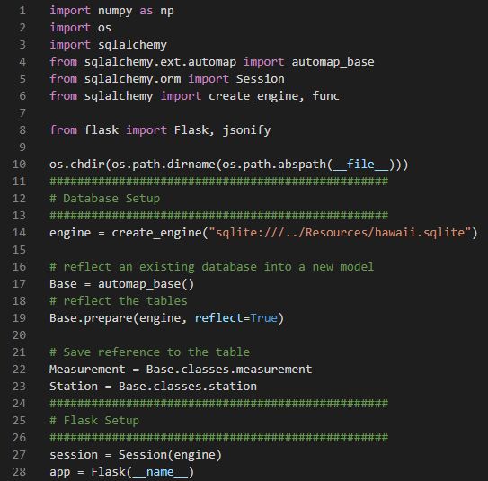
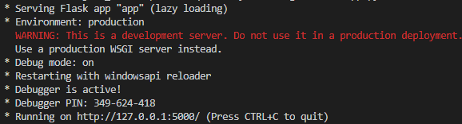
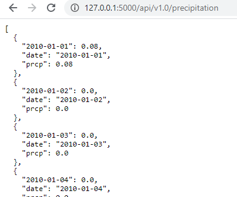
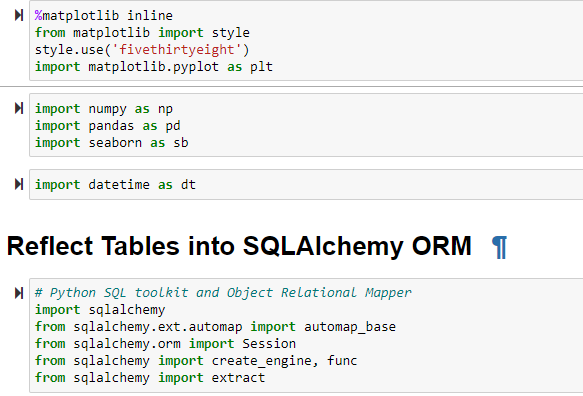
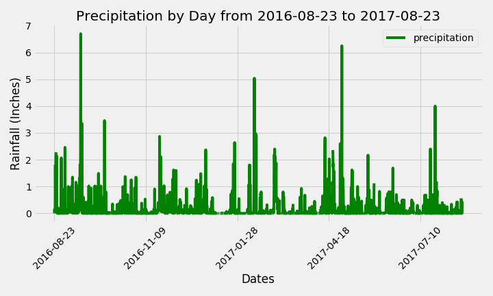
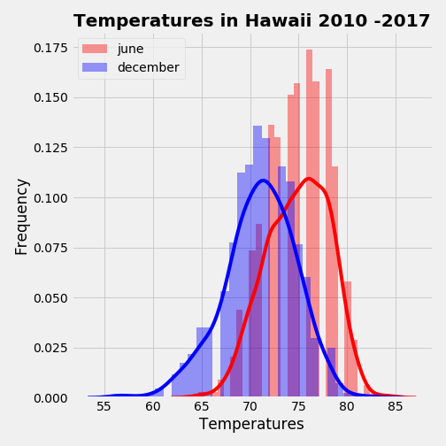

# Hawaii Climate Analysis & Exploration Overview
Python and SQLAlchemy used for a climate analysis of precipitation and station activity in Hawaii within a 12-month timeframe.

Queries designed in a Jupyter Notebook sourced in a .sqlite file.

The following languages used to organize and visualize data: SQLAlchemy queries, Pandas, and Matplotlib.

### Precipitation Analysis covers 
* 12 months of precipitation data
* Pandas DataFrames to sort values
* Summary Statistics of events

### Station Analysis covers
* Total Number of Stations
* Sort the most active stations
* 12 months of temperature data

Descriptive analysis included in 'climate_starter.ipynb'

Python Version 3.76

# RUN INSTRUCTIONS

## Step 1: Installation
To install, use 'pip or 'easy_install'

```bash
$ pip install datetime
```
```bash
$ pip install ipynb
```
```bash
$ pip install matplotlib
```
```bash 
$ pip install numpy
```
```bash
$ pip install pandas
```
```bash
$ pip install seaborn
```
```bash
$ pip install sqlalchemy
```


## Step 2: Setup
Basic Setup for Python/Flask API \

\
Run in the Terminal and display as server\



## Step 3: Run the application
#### Run Flask API from terminal

#### Basic Setup for Jupyter Notebook


#### Run 'climate_starter.ipynb'
\



